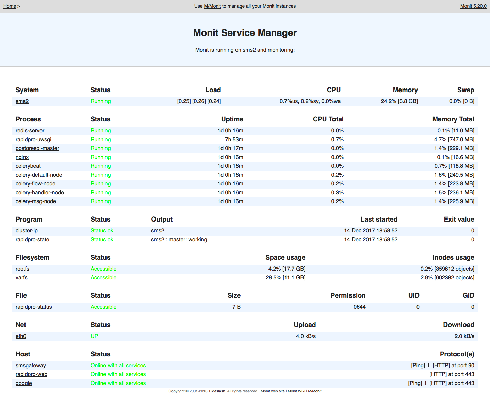
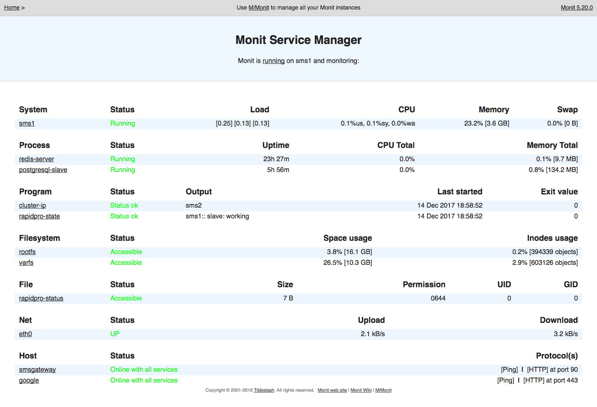

# RapidPro Cluster Recovery Manual

## Periodic monitoring

Although a software monitoring is provided through `monit` and service should continue to function, it is **very important** to periodically check the status of the solution, especially during the first months of operations:

* An unforeseen incident could fail the system without monitoring noticing.
* A failure could occur outside the monitored parts (SMS ?)
* The software monitoring could malfunction.
* The master/slave tilt could malfunction.
* The alter system could malfunction.

---

To check the status of the servers, three tools:

* Hawk Interface, to check the `ha-cluster` status. (`hacluster`/`linux`).
* `monit` Web Interface, to check all monitored services. (`admin`/`monit`).
* RapidPro Web interface itself, to ensure the actual product is working.

**Links**:

* virtual IP: [Hawk](https://10.172.20.200:7630/), [monit](http://10.172.20.200:2812), [RapidPro UI](https://10.172.20.200/)
* sms1: [Hawk](https://10.172.20.201:7630/), [monit](http://10.172.20.201:2812)
* sms2: [Hawk](https://10.172.20.202:7630/), [monit](http://10.172.20.202:2812)

### Using monit

The following *services* are checked by monit.

Two types of reactions to a *monit failure*:

* an alert to the admins for to serve as a warning for failure that are not critical or for which we have no control over.
* a call to the `rapidpro-record-failure` script which itself triggers an alert but also starts the tilt mechanism.

While all non-components checks (system, server, etc) are present at all times, rapidpro components are either not present or different for slave mode where only a working PostgreSQL and redis replication is required.

* System (CPU, RAM, Load average). Alert-only
* `rootfs` & `varfs` (`/` and `/var` where postgres and redis resides). Alert-only
* `nginx` (*master only*). Tests a `GET` request on `/` for both HTTP and HTTPS.
* `postgresql-*`. Tests an actual `psql` connection (*master*) or a `TCP` connection to postgresql port (*slave*).
* `redis-server`. Tests a `TCP` connection to redis port for both master and slave.
* `rapidpro` (*master-only*). Tests a `TCP` connection to the `uwsgi` port serving temba.
* `celery-*` & `celerybeat`. Tests that the corresponding processes are running.
* `rapidpro-status`: displays output of command. Fails only is status is `failure` or unknown. Alert-only.
* `cluster-ip`: displays output of command. Fails only if IP is not assigned to any node. Alert-only
* `network`: Tests that `eth0` is working. Alert-only.
* `google`: Tests that Google.com can be reached via HTTP and HTTPS. Alert-only.
* `sms-gateway`: Tests that the SMS gateway responds to HTTP on port `90`.

#### On a master node



#### On a slave node



---

__Note__: Program checks (`cluster-ip` and `rapidpro-state`) are slow and might not be completely up-to-date ; could be 1mn old. Use command line version for live results.

### Using the command line

``` sh
# list ha-cluster's status (rapidproctl's shortcut)
rapidpro-cluster-status
# list ha-cluster's status
crm_mon -1

# display which node owns the virtual IP
rapidpro-cluster-ip

# display the node's role and status
rapidpro-state

# display the other node's role and status
rapidpro-peer-state

# display postgres processes
rapidpro-postgres-status

# check the running postgres mode (wal sender or wal receiver)
rapidpro-postgres-status |grep wal

# output of rapidpro-cluster-status and systemctl status for all components
rapidpro-status

# verify that rapidproctl config is working (if actions/alerts not triggered)
rapidpro-config

# sends an SMS to all numbers configured
rapidpro-test-sms

# sends an email to all addresses in config + SMS to all numbers in config
rapidpro-alert
```

## Checking SMS capability

Because all interactions with users happen over SMS, it is important to periodically ensure that SMS are working, both `inbound` and `outbound`, for all  operators.

Checks :

1. Create a Flow with a custom trigger (`test`?) that would simply reply. Sending this SMS would allow to quickly make sure both inbound and outbound SMS are working.
* Make sure a log or other trace capability exists on the SMS gateway to help identify whether a non-working SMS issue is related to rapidpro, the gateway or the operator.
* Make sure you have a test number registered to the system and follow-up with each expected message. This would help identify rapidpro-related messaging issues (celery queue mostly)

